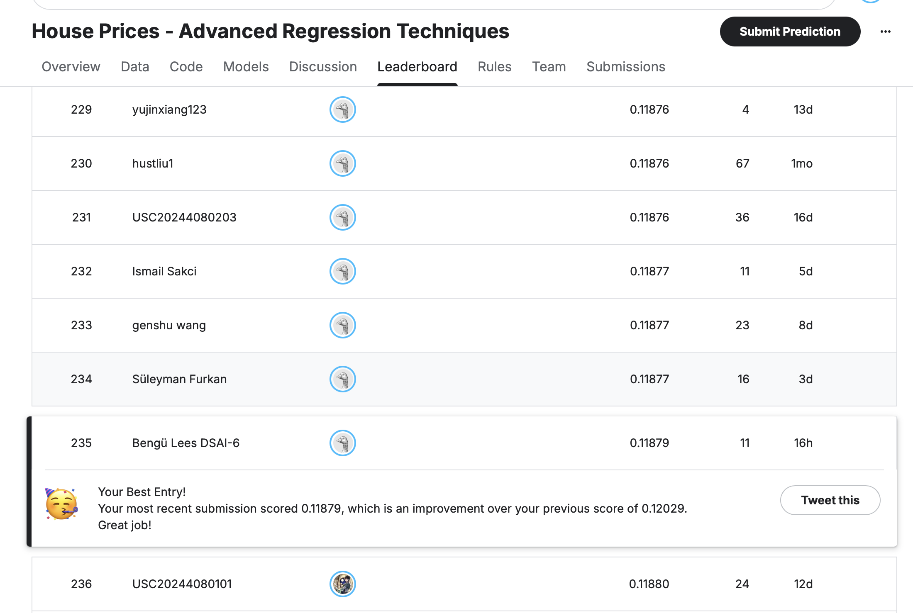

# House Prices Regression Ensemble

## Author

**Bengü Lees**

## Project Overview

This project contains my final solution for the Kaggle **House Prices – Advanced Regression Techniques** competition.

The goal of the competition was to predict the final sale price of residential houses based on different numerical and categorical features.

My final solution achieved:

* **Public leaderboard score:** 0.11879
* **Approximate rank:** 233



## Final Solution

For my final approach, I trained three different regression models separately:

* Gradient Boosting
* tuned CatBoost
* ElasticNet

I did not combine the models during training.

Each model produced its own predictions, and I combined only the final predictions using weighted blending.

The final weights were:

* **22.77% Gradient Boosting**
* **43.23% CatBoost**
* **34% ElasticNet**

## Validation Strategy

I used five-fold cross-validation.

The training data was divided into five parts. For every fold, the model trained on four parts and predicted the remaining part.

This gave me out-of-fold predictions, meaning every training house was predicted by a model that had not trained on that particular house.

I used these out-of-fold predictions to compare the models and calculate the final ensemble score without data leakage.

For the Kaggle test data, every model created predictions in all five folds. I averaged these five predictions before creating the final blend.

## Data Preprocessing

The preprocessing included:

* replacing missing numerical values with the median
* replacing missing categorical values with the most frequent category
* one-hot encoding categorical features
* standardizing numerical features for ElasticNet
* applying `log1p` to strongly skewed numerical features
* applying `log1p` to the target variable `SalePrice`

The log transformation helped reduce the influence of extremely large values and made the data easier for the models to learn.

## Models

### Gradient Boosting

I used a tuned `GradientBoostingRegressor` with Huber loss.

Gradient Boosting was useful because it could learn non-linear relationships between the house features and the sale price.

### CatBoost

CatBoost was the strongest individual model in the final ensemble.

It can work directly with categorical features and is especially useful for datasets containing many categorical variables.

I tuned parameters such as:

* number of iterations
* tree depth
* learning rate
* L2 regularization
* random strength
* bagging temperature

### ElasticNet

ElasticNet is a linear regression model with a combination of L1 and L2 regularization.

Before training ElasticNet, I:

* log-transformed strongly skewed numerical features
* standardized the numerical features
* one-hot encoded the categorical features

ElasticNet learned differently from the two tree-based models, which made it useful in the final ensemble.

## Evaluation Metric

The models were evaluated using **Log RMSE**.

A lower Log RMSE means that the predicted house prices are closer to the actual house prices.

## Final Ensemble

The final prediction was calculated using:

```python
final_prediction = (
    0.2277 * gradient_boosting_prediction
    + 0.4323 * catboost_prediction
    + 0.34 * elasticnet_prediction
)
```

The predictions were blended in log space.

After blending, I used `np.expm1()` to convert the results back into normal house-price values.

## Files

* `Bengue_Lees_House_Prices_Final_Solution.ipynb`
  Complete commented notebook containing the full workflow

* `leaderboard_result.png`
  Screenshot of the public leaderboard result

* `README.md`
  Project overview and explanation

## What I Learned

This project helped me practise and understand:

* regression modelling
* data preprocessing
* missing-value handling
* categorical encoding
* feature scaling
* skewness and log transformation
* model tuning
* five-fold cross-validation
* out-of-fold predictions
* model comparison
* weighted ensemble blending
* Kaggle submission creation

## Technologies Used

* Python
* pandas
* NumPy
* scikit-learn
* CatBoost
* Google Colab
* GitHub
* Kaggle

